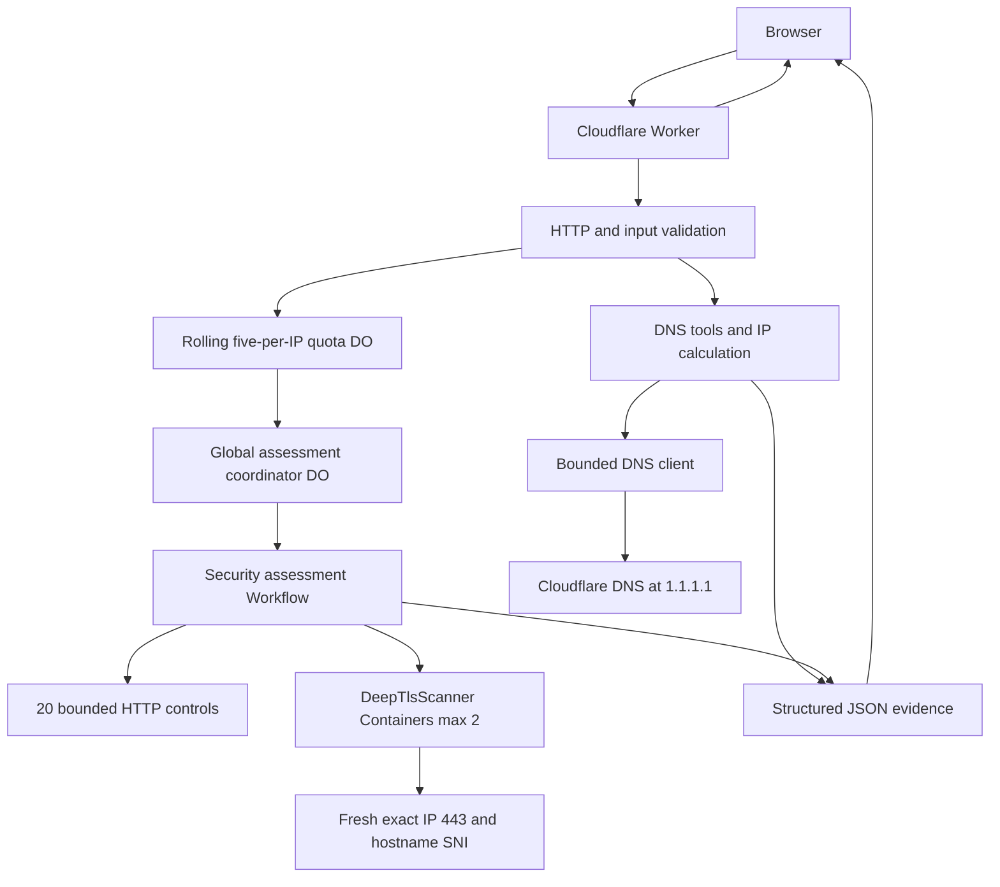

# Architecture

## Overview

Cresswell Security Lab has four product families—Email Security, DNS & OSINT, Network Intelligence, and Web & TLS—and deploys the first three as bounded Worker request paths. The active Web & TLS family adds an asynchronous paid-runtime plane:

1. A Vite-built React single-page application served through Workers Static Assets.
2. A Worker control plane for validation, quota, capability-addressed job status, and fixed DNS/IP operations.
3. One global SQLite Durable Object coordinator for target single-flight, six-hour caching without report duplication, two concurrent jobs, eight pending jobs, at most 256 retained rows, stale-job recovery, and 24-hour job expiry.
4. A Cloudflare Workflow for the combined 20-control web phase and deep TLS endpoint phases.
5. Paid Containers running a trusted, version-pinned `testssl.sh` image with a fixed-target CONNECT proxy.

## Public API surfaces

| Route | Input | Purpose | Bounded behavior |
| --- | --- | --- | --- |
| `GET /api/health` | None | Service metadata | Performs no DNS work |
| `POST /api/scan` | Public `domain` | Email-authentication posture and core DNS context | Fixed checks, bounded DKIM selector set, bounded SPF traversal |
| `POST /api/lookup` | `name` and allowlisted `type` | One DNS lookup or SPF analysis | Ten native record types; `SPF` is a TXT-backed analysis mode |
| `POST /api/dns-snapshot` | Public `domain` | Explicit apex RRsets and security-owner TXT | Eight fixed apex types, four fixed security owners, at most two infrastructure hosts |
| `POST /api/host-discovery` | Public `domain` and `core` or `extended` | Common-name discovery | Seven fixed labels and one random wildcard probe per request |
| `POST /api/ip-network` | One IPv4/IPv6 address, CIDR, or dotted IPv4 netmask | Deterministic network calculation and DNS evidence | Local arithmetic; at most four logical DNS enrichment queries for one global address |
| `POST /api/security-assessments` | Public `hostname`, authorization attestation, deep disclaimer version | Create one combined asynchronous Web & TLS job | Shared five/client-IP/rolling-hour quota; public-IP gates; cache/single-flight; global concurrency two |
| `GET /api/security-assessments/:jobId` | Unguessable job capability | Poll progress or retrieve the combined result | `no-store`; 24-hour expiry; bounded result contract |
| `DELETE /api/security-assessments/:jobId` | Job capability plus creator-only token | Cancel only newly created, still-unshared work | Token digest is irrevocably cleared when another request joins; shared work cannot be cancelled by either caller |
| `POST /api/web-security` | Legacy quick request | Exactly 20 bounded web controls | Shares the same quota; unsupported native TLS evidence is `N/A` |

The DNS-surface interface requests the snapshot, core profile, and extended profile separately. Each request has its own DNS budget and returns independently, so one partial or failed request does not erase usable evidence from the others.

## Request paths

### Email-authentication scan

The main scan resolves DMARC, SPF, a small documented DKIM selector set, mail routing, transport-security records, and core DNS context. Deterministic parsers create findings, remediation guidance, posture, and a configuration score.

### Direct lookup and SPF analysis

Direct lookup allowlists A, AAAA, CAA, CNAME, MX, NS, PTR, SOA, SRV, and TXT. PTR input is converted to a reverse-DNS owner; other types accept a validated public DNS owner name. Non-CNAME lookups can follow a bounded alias chain while preserving the terminal owner.

`SPF` does not query the obsolete SPF resource-record type. It accepts a validated public DNS owner, including underscore-prefixed provider policy owners, queries TXT, keeps separate TXT resource records separate, and selects only complete `v=spf1` policies. Static parsing and bounded recursive traversal expose mechanisms, qualifiers, address ranges, terminal policy, expanded domains, syntax errors, warnings, and a worst-case lookup estimate. Unknown, macro-dependent, cyclic, over-depth, and over-budget branches remain explicitly incomplete.

### Explicit DNS snapshot

The snapshot queries A, AAAA, CAA, CNAME, MX, NS, SOA, and TXT at the requested domain. It separately queries TXT at:

- `_dmarc.<domain>`
- `_mta-sts.<domain>`
- `_smtp._tls.<domain>`
- `default._bimi.<domain>`

MX and NS answers can contribute up to two infrastructure hostnames for direct A/AAAA enrichment. This is relationship context, not recursive asset expansion.

### Bounded host discovery

The `core` and `extended` profiles each contain seven fixed labels. For every candidate, the resolver checks CNAME and then direct A/AAAA at either the candidate or its one discovered alias. The request also checks one cryptographically unpredictable label under the same domain. If a candidate's alias/address fingerprint matches that control, the result is tagged `wildcardMatch`; it is not silently counted as a uniquely configured host.

The API accepts no caller-supplied label list or wordlist. Discovery does not recurse through host relationships, expand netblocks, connect to returned addresses, or make PTR requests.

### IP and subnet calculation

The IP endpoint strictly parses one address or CIDR; IPv4 also accepts a contiguous dotted netmask. It rejects URLs, lists, explicit ranges, scoped IPv6, ambiguous IPv4, and malformed prefixes. Big-integer arithmetic calculates canonical form, network/last address, total and usable ranges, address classification, and IPv4 netmask/wildcard/broadcast without upstream traffic.

DNS enrichment is eligible only when the input is a single globally routable address, whether bare or explicitly `/32` or `/128`. It performs PTR plus Team Cymru origin-AS TXT queries and can resolve AS descriptions within a four-logical-query ceiling. Team Cymru evidence is explicitly attributed and defensively parsed. Multi-address CIDRs and special-use addresses receive `not-applicable` enrichment without DNS work. Enrichment failure produces partial or indeterminate evidence but does not fail a valid local calculation. The dedicated UI validates the response contract before rendering it and exposes the same evidence states as the API.

### Authorized combined Web & TLS assessment

The caller submits one normalized hostname with `authorizedUse: true` and disclaimer version `2026-08-16-deep-v1`. The notice explicitly covers potentially hundreds of bounded TLS handshakes, selected cryptographic flaw probes, target logging, paid-container execution, permission certification, prohibited denial-of-service/crawling/credential actions, and point-in-time/non-compliance limitations. The Worker validates consent and syntax, then consumes exactly one of five accepted starts for the canonical `CF-Connecting-IP` in the preceding 3,600 seconds before any DNS or target traffic. Every accepted POST consumes a slot, including a cache hit or single-flight join; a later failure is not refunded.

The initial hostname must resolve exclusively to public addresses. The coordinator keys single-flight and six-hour completed-result reuse by normalized hostname plus the sorted validated address set. A cache hit returns the existing completed capability and never creates another copy of the report. A new job receives a random 192-bit `sa_…` capability; only its creator receives a separate 256-bit cancellation token, whose digest is stored. Status and cancellation requests first reject explicit cross-site browser traffic and then pass through a per-IP rolling 60-per-minute limiter, so random syntactically valid capabilities cannot directly saturate the one global coordinator. Each client-IP quota object retains at most five assessment events and 60 status/cancellation events and deletes all state after the final rolling event expires. The global scheduler starts no more than two Workflows, admits at most eight pending jobs, and retains at most 256 total rows. A coordinator alarm enforces the 24-hour row/result expiry without waiting for another request. Together with the sub-700-KiB combined-result cap, that row ceiling bounds serialized report storage. A job that reports no progress for 25 minutes is failed and reaped, safely beyond each 180-second endpoint step and the normal progress cadence.

The web phase makes one non-following `HEAD` request at the root HTTP URL and a manual `GET` chain at the root HTTPS URL, optionally observes `OPTIONS`, and requests one unpredictable not-found path. Redirects are restricted to the exact hostname or its single add/remove-`www` counterpart, standard ports, no credentials, at most two HTTPS hops, and no downgrade. Raw Worker sockets pin destinations where the platform permits. Cloudflare-owned destinations that block raw sockets may use the ordinary bounded platform fetch path only after fresh public-DNS validation before and after the request; the result discloses that residual non-pinned path.

HTTP work is capped at six requests, 2.5 seconds per fetch/body read, 30 seconds for the phase, 4,096-character URLs, and 131,072 bytes per inspected response. The analyzer returns exactly 20 deterministic observations. It never logs in, submits a form, crawls, sends an application exploit payload, or accepts a caller-selected URL/path/port/method.

Deep TLS selects at most four representative addresses, balancing IPv4 and IPv6. Before every endpoint, the Workflow resolves the hostname again and requires the exact pre-job public address to remain present. It obtains a one-shot container instance keyed to that job/address, atomically persists a scan-once claim, calls `setAllowedHosts([address])` for HTTP-layer defense in depth, and sends only `{hostname,address,profile:'safe',deadlineMs:180000}`. A replay returns the first stored validated report; an unfinished claim becomes unavailable instead of starting a duplicate active profile. The record remains until the active `step.do` result is durable. Opaque `net.connect` traffic requires `enableInternet=true` and is not constrained by `allowedHosts`. The primary raw-TCP enforcement is therefore the trusted fixed image: its local CONNECT proxy dials only the supplied validated IP on port 443; `testssl.sh` is forced through that proxy with DNS and phone-home disabled; the request schema exposes no command, port, URL, or extra option. The trusted `dispose()` RPC first persists recovery state, confirms the container stopped, and lets a later subclass-owned alarm wipe the replay record, configuration, schedules, and alarm without racing the base Container alarm. Every terminal or recovery path sweeps all possible endpoint identities. Cloudflare's outbound port restrictions and fixed budgets add further bounds, but residual container network capability remains an explicit trust boundary.

Each endpoint runs three concurrent fixed testssl parent runners under a UID-wide 48-process ceiling, five concurrent connections, 128 total connections, and three phases—identity, cryptography, and compatibility—under a 180-second deadline. The fixed profile covers certificate/chain identity, protocols, server cipher preference, key exchange, features, client simulations, and bounded Heartbleed, CCS-injection, Ticketbleed, and ROBOT probes. It does not run denial-of-service tests, crawl, authenticate, submit credentials, or accept custom switches. Each raw response is capped at 163,840 bytes, displayed endpoint evidence at 128 KiB, and the combined result below 700 KiB.

## Result and failure model

DNS absence and DNS unavailability have different meanings:

| State | Meaning | Client behavior |
| --- | --- | --- |
| `found` | One or more records were returned | Show the raw records |
| `empty` | The resolver reported no answer for this type/name | Show absence without inventing a failure |
| `unavailable` | Timeout, refusal, transport failure, or another indeterminate resolver error | Preserve partial results and invite retry |

Snapshot groups and security records use these states directly. If some snapshot queries are unavailable, the endpoint returns `200` with `unavailableCount`; if every apex RRset group is unavailable, it returns a sanitized `502`. Host discovery returns successfully resolved candidates alongside `unavailableNames`; an unavailable candidate is never treated as absent. The three DNS-surface requests can therefore render partial data and request-specific errors without stale results from an earlier domain.

Web checks use `pass`, `warning`, `fail`, `not-applicable`, or `unknown`. Missing evidence remains unknown and is not scored as weakness. A web letter grade requires at least 70% of applicable weight plus bounded HTTPS-enforcement, HSTS, and CSP evidence; confirmed HTTPS failure forces `F`. Deep TLS observations carry `tested`, `inferred`, or `not-testable` evidence. Its separate Cresswell grade requires at least 70% aggregate endpoint weight; missing endpoints and unknown observations do not become failures. Both grades can independently be `N/A`.

## Trust boundaries

### Browser input

JSON requests are stream-read only to 2,048 bytes, canceled on overflow, decoded as strict UTF-8, and checked for required object keys. Domain routes reject email addresses, IP literals, credentials, ports, paths, local names, malformed labels, and overlong values. The active assessment also requires exact versioned consent and accepts no URL, path, IP literal, port, method, payload, credential, scanner flag, or wordlist. Callers cannot select a target address, container command, or active test.

### DNS answers

Every DNS, HTTP, TLS, and certificate value is attacker-controlled data. The DNS layer caps answer counts and character volume, normalizes values, and preserves TXT resource-record boundaries. The web layer bounds and sanitizes header, certificate, URL, cookie, and HTML-derived evidence. The React client renders values as text and does not insert observed data as raw HTML.

### Upstream requests

All resolution uses Cloudflare Workers' fixed native `node:dns` resolver. Concurrency, time, CNAME traversal, SPF recursion, result size, and physical query attempts are bounded and cached within a request. DNS-only routes never convert discovered data into a service connection. The web phase contacts only the exact input hostname or direct `www` counterpart; the deep phase contacts only freshly revalidated addresses from the initial safe set. No hostname discovered by another tool becomes an active target.

## Completeness boundary

The snapshot uses explicit record-type queries; it does not use `ANY`. `ANY` means “whatever data the server chooses to return for this owner,” not “all records in the zone,” and authoritative servers may intentionally minimize it under [RFC 8482](https://www.rfc-editor.org/rfc/rfc8482.html). Neither approach discovers unknown owner names.

Common-name discovery tests only its documented labels. The Worker does not consume certificate-transparency logs, historical/passive-DNS databases, search indexes, crawling datasets, or zone transfers. Its output is therefore not exhaustive and is not DNSDumpster-equivalent passive data.

## Active-tool boundary

This public system includes one explicitly authorized, fixed Web & TLS assessment. Selected cryptographic flaw probes are active, but bounded and non-configurable. General port/exploit scanning, ping, traceroute, AXFR, arbitrary HTTP, crawling, authentication, state-changing requests, and denial-of-service work remain excluded.

Any broader future active-scanning plane must be separate from the current public toolbox routes and require, at minimum:

- Authenticated users and auditable identities
- Proof that the user controls the target domain or address, with special handling for shared infrastructure
- Allowlisted operations and target scope
- Per-user and per-target quotas, concurrency controls, and rate limits
- Durable queues, cancellation, bounded retries, and result-expiry rules
- Isolated, deny-by-default egress with protection for private, link-local, metadata, and control-plane ranges
- Output, time, redirect, and response-size limits
- Abuse reporting, suspension, retention, and operator review controls

The deterministic IP/CIDR tool does not change this boundary: its UI and API may request reverse and attribution DNS only for the exact single global address supplied, and they never send packets to that address. The web authorization checkbox and per-IP quota reduce casual abuse but do not prove ownership, so broader or higher-impact operations still require the controls above.

## Why AI is not in the core scanner

Protocol interpretation and enforcement gates must be reproducible and testable. A future LLM layer may explain findings or select a vendor-specific remediation playbook, but it must consume structured evidence and return schema-constrained suggestions. It must not:

- Decide whether a domain is safe for enforcement
- Publish DNS changes
- Treat instructions embedded in DNS or reports as trusted
- Replace parser or policy logic

## Persistence

Persistence includes at most five rolling assessment timestamps plus 60 status/cancellation timestamps in each client-IP-derived Durable Object and no more than 256 capability-addressed assessment rows in the global coordinator, of which no more than eight may be pending. Limiter and coordinator alarms enforce timestamp expiry and 24-hour job/result deletion without relying on later traffic; a completed result may be reused for the same hostname/address set for six hours without duplicating its stored JSON. Raw client IPs are not stored in coordinator job state. The default unkeyed quota-object digest remains pseudonymous and potentially guessable; operators can configure a secret to use HMAC object names. Internal legacy digest/probe identifiers remain for compatibility and do not represent the public brand.

Future aggregate-report ingestion will introduce object storage for encrypted originals, a relational database for normalized rows and tenants, a queue for parsing, and authenticated ownership. Those components are deliberately excluded from the public scanner.
