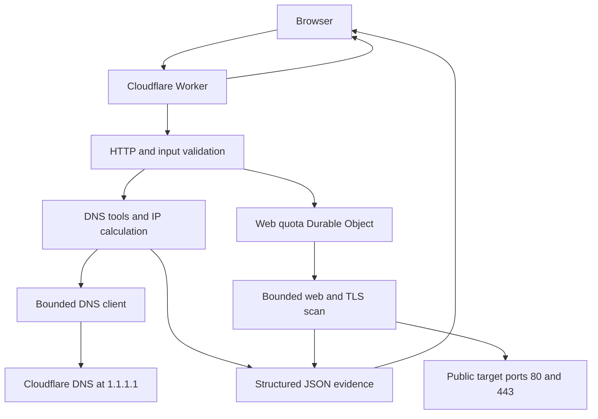

# Architecture

## Overview

DMARC Ready deploys as one Cloudflare Worker containing two layers:

1. A Vite-built React single-page application served through Workers Static Assets.
2. A Worker API that validates bounded DNS requests and one narrowly authorized web/TLS scan, uses Cloudflare runtime services, and returns structured JSON.

## Public API surfaces

| Route | Input | Purpose | Bounded behavior |
| --- | --- | --- | --- |
| `GET /api/health` | None | Service metadata | Performs no DNS work |
| `POST /api/scan` | Public `domain` | Email-authentication posture and core DNS context | Fixed checks, bounded DKIM selector set, bounded SPF traversal |
| `POST /api/lookup` | `name` and allowlisted `type` | One DNS lookup or SPF analysis | Ten native record types; `SPF` is a TXT-backed analysis mode |
| `POST /api/dns-snapshot` | Public `domain` | Explicit apex RRsets and security-owner TXT | Eight fixed apex types, four fixed security owners, at most two infrastructure hosts |
| `POST /api/host-discovery` | Public `domain` and `core` or `extended` | Common-name discovery | Seven fixed labels and one random wildcard probe per request |
| `POST /api/ip-network` | One IPv4/IPv6 address, CIDR, or dotted IPv4 netmask | Deterministic network calculation and DNS evidence | Local arithmetic; at most four logical DNS enrichment queries for one global address |
| `POST /api/web-security` | Public `hostname`, authorization attestation, disclaimer version | TLS posture and exactly 20 passive/basic web-hardening checks | Five scans/client IP/rolling hour; fixed ports/methods, public-address gates, bounded redirects, bytes, requests, TLS endpoints, and timeouts |

The DNS-surface interface requests the snapshot, core profile, and extended profile separately. Each request has its own DNS budget and returns independently, so one partial or failed request does not erase usable evidence from the others.

## Request paths

### Email-authentication scan

The main scan resolves DMARC, SPF, a small documented DKIM selector set, mail routing, transport-security records, and core DNS context. Deterministic parsers create findings, remediation guidance, posture, and a configuration score.

### Direct lookup and SPF analysis

Direct lookup allowlists A, AAAA, CAA, CNAME, MX, NS, PTR, SOA, SRV, and TXT. PTR input is converted to a reverse-DNS owner; other types accept a validated public DNS owner name. Non-CNAME lookups can follow a bounded alias chain while preserving the terminal owner.

`SPF` does not query the obsolete SPF resource-record type. It accepts a validated public DNS owner, including underscore-prefixed provider policy owners, queries TXT, keeps separate TXT resource records separate, and selects only complete `v=spf1` policies. Static parsing and bounded recursive traversal expose mechanisms, qualifiers, address ranges, terminal policy, expanded domains, syntax errors, warnings, and a worst-case lookup estimate. Unknown, macro-dependent, cyclic, over-depth, and over-budget branches remain explicitly incomplete.

### Explicit DNS snapshot

The snapshot queries A, AAAA, CAA, CNAME, MX, NS, SOA, and TXT at the requested domain. It separately queries TXT at:

- `_dmarc.<domain>`
- `_mta-sts.<domain>`
- `_smtp._tls.<domain>`
- `default._bimi.<domain>`

MX and NS answers can contribute up to two infrastructure hostnames for direct A/AAAA enrichment. This is relationship context, not recursive asset expansion.

### Bounded host discovery

The `core` and `extended` profiles each contain seven fixed labels. For every candidate, the resolver checks CNAME and then direct A/AAAA at either the candidate or its one discovered alias. The request also checks one cryptographically unpredictable label under the same domain. If a candidate's alias/address fingerprint matches that control, the result is tagged `wildcardMatch`; it is not silently counted as a uniquely configured host.

The API accepts no caller-supplied label list or wordlist. Discovery does not recurse through host relationships, expand netblocks, connect to returned addresses, or make PTR requests.

### IP and subnet calculation

The IP endpoint strictly parses one address or CIDR; IPv4 also accepts a contiguous dotted netmask. It rejects URLs, lists, explicit ranges, scoped IPv6, ambiguous IPv4, and malformed prefixes. Big-integer arithmetic calculates canonical form, network/last address, total and usable ranges, address classification, and IPv4 netmask/wildcard/broadcast without upstream traffic.

DNS enrichment is eligible only when the input is a single globally routable address, whether bare or explicitly `/32` or `/128`. It performs PTR plus Team Cymru origin-AS TXT queries and can resolve AS descriptions within a four-logical-query ceiling. Team Cymru evidence is explicitly attributed and defensively parsed. Multi-address CIDRs and special-use addresses receive `not-applicable` enrichment without DNS work. Enrichment failure produces partial or indeterminate evidence but does not fail a valid local calculation. The dedicated UI validates the response contract before rendering it and exposes the same evidence states as the API.

### Authorized web and TLS posture scan

The caller must submit one normalized hostname with `authorizedUse: true` and disclaimer version `2026-08-16`. The Worker validates consent and syntax before consuming quota. It trusts only `CF-Connecting-IP`, canonicalizes IPv4/IPv6, derives a domain-separated SHA-256 object name (or HMAC-SHA-256 when the optional deployment secret is configured), and addresses one SQLite Durable Object. A synchronous storage transaction removes expired timestamps and accepts no more than five events in the preceding 3,600 seconds. A denied attempt produces `429` without target work; a slot accepted before scan execution is not refunded after a target/upstream failure.

The scanner resolves A and AAAA through the fixed resolver and requires every answer to be a valid globally routable address. It makes one non-following `HEAD` request at the root HTTP URL and a manual `GET` chain at the root HTTPS URL, optionally observes `OPTIONS`, and requests one unpredictable scanner-generated HTTPS not-found path. Redirects are limited to the exact hostname and its direct `www` counterpart, standard HTTP/HTTPS ports, no credentials, at most two HTTPS hops, and no HTTPS downgrade. Every destination is resolved and checked immediately before each request and again afterward; a changed address set is rejected as possible rebinding. Because Cloudflare `fetch` cannot pin arbitrary external Host/SNI traffic to the prevalidated IP, this detects address changes but cannot retroactively prevent a request if a change occurred only during the platform lookup. The Worker has no private VPC binding.

HTTP work is capped at six requests, 2.5 seconds per fetch/body read, 30 seconds for the whole scan, 4,096-character URLs, and 131,072 bytes per inspected root/error response. The analyzer returns exactly 20 deterministic observations from status, headers, cookies, bounded HTML, and the not-found response. It never logs in, submits a form, crawls, sends exploit payloads, or accepts a caller-selected URL/path/port/method.

The TLS scanner connects directly to at most two already validated IP addresses on port 443 while sending the requested hostname as SNI. Each ready endpoint uses one default handshake, four version-specific profiles, and one fixed legacy CBC profile, with an independent 3.5-second wall-clock deadline per connection. It reports certificate/chain details, trust and hostname validity, cipher, ALPN, ephemeral-key detail, and protocol observations. Cloudflare-range and Worker-self-loop socket blocks become explicit unavailable evidence. This is a bounded snapshot, not the exhaustive client/cipher/vulnerability coverage of SSL Labs.

## Result and failure model

DNS absence and DNS unavailability have different meanings:

| State | Meaning | Client behavior |
| --- | --- | --- |
| `found` | One or more records were returned | Show the raw records |
| `empty` | The resolver reported no answer for this type/name | Show absence without inventing a failure |
| `unavailable` | Timeout, refusal, transport failure, or another indeterminate resolver error | Preserve partial results and invite retry |

Snapshot groups and security records use these states directly. If some snapshot queries are unavailable, the endpoint returns `200` with `unavailableCount`; if every apex RRset group is unavailable, it returns a sanitized `502`. Host discovery returns successfully resolved candidates alongside `unavailableNames`; an unavailable candidate is never treated as absent. The three DNS-surface requests can therefore render partial data and request-specific errors without stale results from an earlier domain.

Web checks use `pass`, `warning`, `fail`, `not-applicable`, or `unknown`. Missing evidence caused by an unreachable root, truncated input, a platform-blocked TLS socket, or another bounded failure remains `unknown`/unavailable and is not scored as a confirmed weakness. A web letter grade requires at least 70% of applicable check weight plus bounded HTTPS-enforcement, HSTS, and CSP evidence; confirmed HTTPS failure forces `F`. The web response reports evaluated/unknown/not-applicable coverage and actual HTTP/TLS budget use. TLS has its own `complete`, `partial`, or `unavailable` state and can carry an `N/A` grade independently of the HTTP hardening grade.

## Trust boundaries

### Browser input

JSON requests are stream-read only to 2,048 bytes, canceled on overflow, decoded as strict UTF-8, and checked for required object keys. Domain routes accept a normalized public domain: they reject email addresses, IP literals, credentials, ports, paths, local names, malformed labels, and overlong values. Direct lookup accepts a validated public owner and an allowlisted mode; PTR accepts one IP address. The IP calculator accepts one strict address/CIDR but never uses a CIDR as an active scan range. The web scan also requires exact consent and accepts no URL, path, port, method, payload, or credentials. Callers cannot select an upstream resolver, arbitrary protocol, DNS record type, or discovery label.

### DNS answers

Every DNS, HTTP, TLS, and certificate value is attacker-controlled data. The DNS layer caps answer counts and character volume, normalizes values, and preserves TXT resource-record boundaries. The web layer bounds and sanitizes header, certificate, URL, cookie, and HTML-derived evidence. The React client renders values as text and does not insert observed data as raw HTML.

### Upstream requests

All resolution uses Cloudflare Workers' fixed native `node:dns` resolver. Concurrency, time, CNAME traversal, SPF recursion, result size, and physical query attempts are bounded and cached within a request. IP attribution uses Team Cymru's published DNS mapping service rather than an HTTP fetch. DNS-only routes never convert a returned host, IP address, TXT value, or CNAME into an HTTP request or service connection. The web route contacts only the exact input hostname or direct `www` counterpart under its fixed policy; every resolved address is validated, and no hostname discovered by another tool becomes a web target.

## Completeness boundary

The snapshot uses explicit record-type queries; it does not use `ANY`. `ANY` means “whatever data the server chooses to return for this owner,” not “all records in the zone,” and authoritative servers may intentionally minimize it under [RFC 8482](https://www.rfc-editor.org/rfc/rfc8482.html). Neither approach discovers unknown owner names.

Common-name discovery tests only its documented labels. The Worker does not consume certificate-transparency logs, historical/passive-DNS databases, search indexes, crawling datasets, or zone transfers. Its output is therefore not exhaustive and is not DNSDumpster-equivalent passive data.

## Active-tool boundary

This public Worker includes one explicitly authorized, tightly bounded web/TLS observation route. It is not configurable as a general active scanner. Port and exploit scanning, ping, traceroute, AXFR, banner collection, arbitrary HTTP fetches, crawling, authentication, state-changing requests, and other HackerTarget-like probes remain excluded. Exposing those operations anonymously would let callers turn the service into a scanning relay or SSRF primitive, impose traffic on third-party targets, and make per-target authorization and abuse response impossible to enforce reliably.

Any broader future active-scanning plane must be separate from the current public toolbox routes and require, at minimum:

- Authenticated users and auditable identities
- Proof that the user controls the target domain or address, with special handling for shared infrastructure
- Allowlisted operations and target scope
- Per-user and per-target quotas, concurrency controls, and rate limits
- Durable queues, cancellation, bounded retries, and result-expiry rules
- Isolated, deny-by-default egress with protection for private, link-local, metadata, and control-plane ranges
- Output, time, redirect, and response-size limits
- Abuse reporting, suspension, retention, and operator review controls

The deterministic IP/CIDR tool does not change this boundary: its UI and API may request reverse and attribution DNS only for the exact single global address supplied, and they never send packets to that address. The web authorization checkbox and per-IP quota reduce casual abuse but do not prove ownership, so broader or higher-impact operations still require the controls above.

## Why AI is not in the core scanner

Protocol interpretation and enforcement gates must be reproducible and testable. A future LLM layer may explain findings or select a vendor-specific remediation playbook, but it must consume structured evidence and return schema-constrained suggestions. It must not:

- Decide whether a domain is safe for enforcement
- Publish DNS changes
- Treat instructions embedded in DNS or reports as trusted
- Replace parser or policy logic

## Persistence

Current persistence is limited to at most five rolling rate-limit timestamps inside each client-IP-derived SQLite Durable Object; scan evidence and history are not stored. The raw IP is not stored, although an unkeyed fallback digest remains pseudonymous and potentially guessable. Operators can configure a secret to use HMAC object names.

Future aggregate-report ingestion will introduce object storage for encrypted originals, a relational database for normalized rows and tenants, a queue for parsing, and authenticated ownership. Those components are deliberately excluded from the public scanner.
