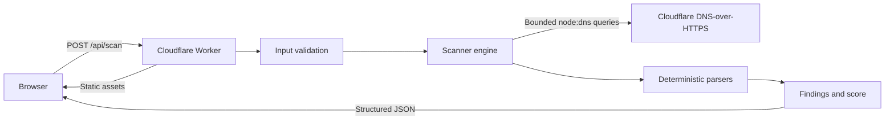

# Architecture

## Overview

DMARC Ready deploys as one Cloudflare Worker containing two layers:

1. A Vite-built React single-page application served through Workers Static Assets.
2. A Worker API that handles `/api/*`, validates domain input, performs bounded DNS-over-HTTPS queries, and returns structured JSON.

## Trust boundaries

### Browser input

The API accepts a single domain value. It rejects email addresses, IP literals, credentials, ports, paths, local names, malformed labels, and overlong values. The user cannot choose the upstream resolver or DNS record type.

### DNS answers

Every record is attacker-controlled text. DNS data is parsed with size limits and returned as JSON. React renders values as text; no raw HTML rendering is used.

### Upstream requests

All resolution uses a fixed HTTPS endpoint. The scanner cannot fetch a URL derived from user input, preventing the scan endpoint from becoming a general-purpose SSRF proxy.

## Request flow

1. Validate HTTP method, content type, and body size.
2. Normalize and validate the requested public domain.
3. Execute fixed DNS queries with timeouts and a shared budget.
4. Parse TXT record boundaries without combining separate resource records.
5. Analyze DMARC, SPF, mail routing, transport controls, and limited DKIM selector evidence.
6. Produce stable check identifiers and deterministic findings.
7. Return JSON with `Cache-Control` and security headers.

## Why AI is not in the core scanner

Protocol interpretation and enforcement gates must be reproducible and testable. A future LLM layer may explain findings or select a vendor-specific remediation playbook, but it must consume structured evidence and return schema-constrained suggestions. It must not:

- Decide whether a domain is safe for enforcement
- Publish DNS changes
- Treat instructions embedded in DNS or reports as trusted
- Replace parser or policy logic

## Future persistence

Aggregate-report ingestion will introduce object storage for encrypted originals, a relational database for normalized rows and tenants, a queue for parsing, and authenticated ownership. Those components are deliberately excluded from the public-scanner MVP.
